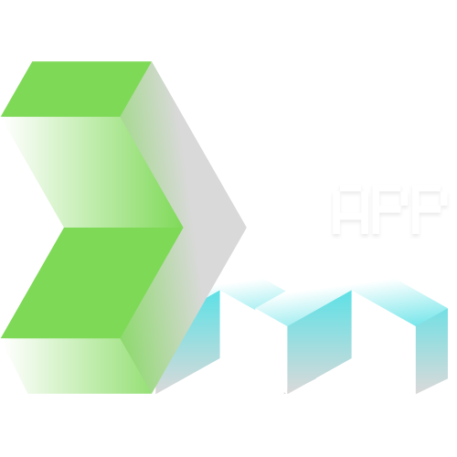
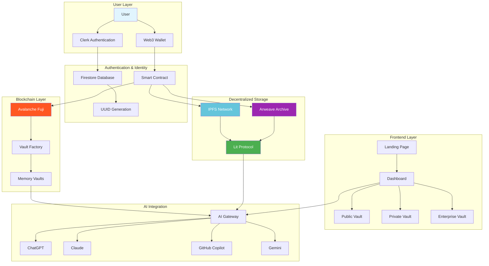
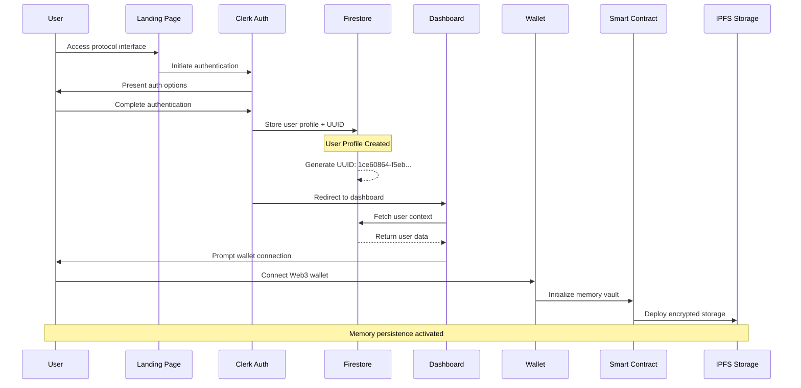

<div align="center">
  
</div>

# De-MAPP – Decentralized Multi-Agent Persistent Protocol

<p align="center">
  
</p>

<div align="center">
<table>
<tbody>
<td align="center">
<a href="https://marketplace.visualstudio.com/items?itemName=demapp.protocol" target="_blank"><strong>Download Extension</strong></a>
</td>
<td align="center">
<a href="https://discord.gg/demapp" target="_blank"><strong>Discord</strong></a>
</td>
<td align="center">
<a href="https://www.reddit.com/r/demapp/" target="_blank"><strong>r/demapp</strong></a>
</td>
<td align="center">
<a href="https://github.com/Priyank911/de-mapp/discussions/categories/feature-requests" target="_blank"><strong>Feature Requests</strong></a>
</td>
<td align="center">
<a href="#getting-started" target="_blank"><strong>Getting Started</strong></a>
</td>
</tbody>
</table>
</div>

Meet De-MAPP, a decentralized protocol that enables **persistent memory across AI agents**.

Thanks to [Avalanche's high-performance blockchain infrastructure](https://www.avax.network/) and advanced cryptographic security, De-MAPP solves the fundamental problem of memory fragmentation in AI interactions. With distributed storage that maintains conversation context, cross-platform synchronization capabilities, and privacy-preserving encryption, De-MAPP creates a universal memory layer that any AI system can utilize. While traditional AI services operate in isolated environments where each conversation starts fresh, this protocol provides a persistent foundation where your interactions, preferences, and context follow you across every AI platform.

1. **Connect your AI services** and establish persistent memory vaults secured by your Web3 wallet.
2. **De-MAPP analyzes** your interaction patterns and conversation history to optimize memory allocation across distributed networks.
3. **Once integrated**, De-MAPP can:
    - Maintain conversation context that persists across sessions and platforms
    - Enable cross-agent knowledge sharing while preserving privacy through encryption
    - Synchronize preferences and learned behaviors across multiple AI services simultaneously
    - Create verifiable audit trails for all memory operations on the blockchain
4. **When tasks complete**, De-MAPP ensures all context is permanently stored in decentralized infrastructure, accessible only through your cryptographic keys.

> **Note:** De-MAPP transforms isolated AI conversations into a connected intelligence network where your digital interactions accumulate value over time, creating a persistent AI companion that truly understands your needs.

---


<!-- Transparent pixel to create line break after floating image -->
<br>


### Smart Contract

De-MAPP's core functionality is powered by a verified smart contract deployed on Avalanche Fuji testnet, ensuring transparent and immutable memory operations with minimal gas costs.

**Contract Details:**

<div align="center">

| Property | Value |
|----------|-------|
| **Contract Address** | [`0x324F02AFD4ab534454d841E6dD83431518CcFABB`](https://testnet.snowtrace.io/address/0x324F02AFD4ab534454d841E6dD83431518CcFABB) |
| **Network** | Avalanche Fuji Testnet |
| **Contract Name** | DataStorage |
| **Compiler Version** | Solidity ^0.8.0 |
| **Verification Status** | Fully Verified |

</div>

**Core Functions:**
- `storeCID(string memory cid)`: Store content identifiers with automatic duplicate prevention
- `getCIDsByUser(address user)`: Retrieve all memory fragments for authenticated users
- `cidExists(string memory cid)`: Check content existence for efficient storage management
- `getCIDCount()`: Global network statistics and usage metrics
- `getUser(string memory cid)`: Ownership verification for access control

The contract implements gas-optimized storage patterns and comprehensive event emission for complete operation transparency.

<!-- Transparent pixel to create line break after floating image -->
<br>


### Memory Vault Management

De-MAPP creates and manages persistent memory vaults directly through your connected services, presenting you with a comprehensive view of all stored interactions. You can organize, search, and analyze your AI conversation history with advanced filtering and visualization tools.

The system automatically categorizes conversations by topic, sentiment, and importance, while maintaining complete user control over data organization and access permissions. All memory operations are recorded in your vault's timeline, providing an easy way to track and manage your digital interactions.

**Vault Features:**
- Automatic conversation categorization and tagging
- Advanced search across all stored interactions
- Visual timeline of memory operations and access patterns
- Granular privacy controls with selective sharing capabilities
- Integration with existing productivity workflows

<!-- Transparent pixel to create line break after floating image -->
<br>


### Cross-Platform Synchronization

With De-MAPP's universal memory protocol, context and preferences seamlessly transfer between AI services. Start a conversation in ChatGPT, continue it in Claude, and reference the context in GitHub Copilot – all while maintaining perfect continuity.

The protocol handles real-time synchronization of conversation states, learned preferences, and contextual relationships across all connected platforms. Advanced conflict resolution ensures consistency when multiple services access the same memory simultaneously.

**Synchronization Capabilities:**
- Real-time context sharing across all AI platforms
- Intelligent conflict resolution for concurrent access
- Preference learning that improves recommendations over time
- Cross-platform conversation threading and relationship mapping
- Automatic backup and redundancy across multiple storage nodes

<!-- Transparent pixel to create line break after floating image -->
<br>


### "Configure memory for..."

De-MAPP supports extensible memory configurations tailored to specific use cases. The protocol can be customized for different workflows, from software development and creative writing to research and business intelligence.

Just specify your use case and De-MAPP will automatically configure optimal memory patterns, storage strategies, and synchronization rules. These configurations can be shared with teams or published as templates for the community.

**Example Configurations:**
- **Software Development**: Code context, documentation references, and debugging sessions
- **Content Creation**: Research notes, writing drafts, and creative iteration tracking  
- **Business Intelligence**: Meeting summaries, decision tracking, and strategic planning
- **Academic Research**: Literature reviews, experiment tracking, and collaboration notes

<!-- Transparent pixel to create line break after floating image -->
<br>


### Advanced Context Integration

**`@commit`:** Push your current conversation context to IPFS for permanent storage.

**`@mapp : in`:** Fetch your stored context from IPFS and create virtual memory for the agent.

**`@help`:** Display help documentation and available commands for De-MAPP protocol.


<!-- Transparent pixel to create line break after floating image -->
<br>


### Memory Snapshots

As you interact with AI services, De-MAPP automatically creates memory snapshots at key conversation milestones. You can use the 'Compare' feature to see how your AI interactions have evolved over time, and the 'Restore' function to revisit previous conversation states.

For complex projects spanning multiple AI platforms, you can create manual snapshots before major transitions, then restore to those points if you want to explore alternative approaches. This enables safe experimentation with different AI strategies while maintaining your progress.

**Snapshot Features:**
- Automatic milestone detection and snapshot creation
- Manual snapshot creation for important conversation states
- Cross-platform comparison showing interaction evolution
- Selective restoration of conversation contexts or complete memory states
- Collaborative snapshots for team-based AI workflows

<!-- Transparent pixel to create line break after floating image -->
<br>

## System Architecture



---

## User Journey Flow



---

## Technology Stack

<div align="center">

| Layer | Technology | Purpose |
|-------|------------|---------|
| **Frontend** | React + TypeScript + Vite | Modern UI development with type safety |
| **Styling** | Tailwind CSS | Utility-first responsive design system |
| **Authentication** | Clerk + OAuth 2.0 | Secure user management with Web3 integration |
| **Database** | Firebase Firestore | Real-time data synchronization |
| **Blockchain** | Avalanche Fuji Testnet | Smart contract deployment and execution |
| **Storage** | IPFS + Arweave | Distributed and permanent data storage |
| **Encryption** | Lit Protocol | Decentralized key management |
| **Identity** | Web3 Wallets | User-controlled cryptographic authentication |

</div>

---

## Competitive Advantage Matrix

<div align="center">

| **Capability** | **De-MAPP** | **ChatGPT** | **Claude** | **GitHub Copilot** | **Google Gemini** |
|:---|:---:|:---:|:---:|:---:|:---:|
| **Persistent Memory** | **Permanent** | Session-only | Session-only | Session-only | Session-only |
| **Cross-Platform Sync** | **Universal** | Isolated | Isolated | Isolated | Isolated |
| **Data Ownership** | **User Controlled** | Corporate | Corporate | Corporate | Corporate |
| **Decentralized Storage** | **Distributed** | Centralized | Centralized | Centralized | Centralized |
| **Privacy Guarantees** | **Cryptographic** | Server-side | Server-side | Server-side | Server-side |
| **Interoperability** | **Protocol-based** | API Limited | API Limited | API Limited | API Limited |
| **Auditability** | **Blockchain Verified** | Opaque | Opaque | Opaque | Opaque |
| **Extensibility** | **Unlimited** | Restricted | Restricted | Restricted | Restricted |

</div>

**Key Differentiators:** While existing AI services provide powerful capabilities within their platforms, De-MAPP creates the missing infrastructure layer that enables true AI memory persistence and cross-platform intelligence. This fundamental difference transforms how users interact with AI systems, creating value that compounds over time rather than resetting with each session.

---

## Getting Started

### Prerequisites

- Node.js 18+ with npm/yarn
- Modern web browser with Web3 support
- Compatible wallet (MetaMask, WalletConnect, etc.)

### Installation

```bash
# Clone the repository
git clone https://github.com/Priyank911/de-mapp.git
cd de-mapp

# Install dependencies
npm install

# Configure environment variables
cp .env.example .env

# Start development server
npm run dev
```

### Quick Setup

1. **Authentication**: Sign in using Google OAuth or connect your Web3 wallet
2. **Profile Creation**: Complete the onboarding flow and generate your unique UUID
3. **Memory Vault**: Initialize your personal memory vault through smart contract interaction
4. **AI Integration**: Connect your preferred AI services through the settings panel
5. **Start Using**: Begin conversations knowing that context will persist across all platforms

### Configuration

```javascript
// Environment variables
VITE_AVALANCHE_RPC_URL=https://api.avax-test.network/ext/bc/C/rpc
VITE_CONTRACT_ADDRESS=0x324F02AFD4ab534454d841E6dD83431518CcFABB
VITE_IPFS_GATEWAY=https://gateway.pinata.cloud
VITE_CLERK_PUBLISHABLE_KEY=your_clerk_key
VITE_FIREBASE_PROJECT_ID=your_project_id
```

---

## Roadmap

**Current Development**
- Dashboard interface with real-time blockchain integration
- Web3 wallet connection and smart contract interaction
- Basic IPFS storage implementation for content addressing

**Next Phase**
- Lit Protocol integration for advanced encryption and key management
- AI service API implementations for memory synchronization
- Browser extension for seamless integration with existing workflows

**Future Development**
- Mobile applications for iOS and Android platforms
- Enterprise features with team collaboration and management tools
- Advanced analytics and AI interaction pattern recognition
- Mainnet deployment with production-grade security audits

---

## Contributing

We welcome contributions from developers, designers, and AI enthusiasts. Start with our [Contributing Guide](CONTRIBUTING.md) to understand the development workflow and coding standards.

**Development Areas:**
- **Protocol Development**: Core memory persistence algorithms and blockchain integration
- **Frontend Development**: React components, user experience, and interface design
- **AI Integration**: API implementations and cross-platform synchronization
- **Security**: Smart contract auditing, encryption protocols, and privacy features
- **Documentation**: Technical guides, tutorials, and API documentation

Join our community on [Discord](https://discord.gg/demapp) to collaborate with other contributors or explore opportunities on our [careers page](https://demapp.bot/careers).

---

## License

[MIT License © 2025 De-MAPP Protocol](./LICENSE)

---

<div align="center">
<strong>De-MAPP: Universal Memory for AI Interactions</strong>
</div>