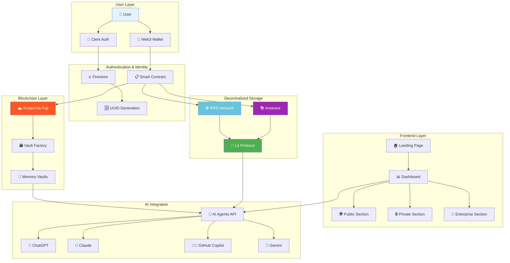
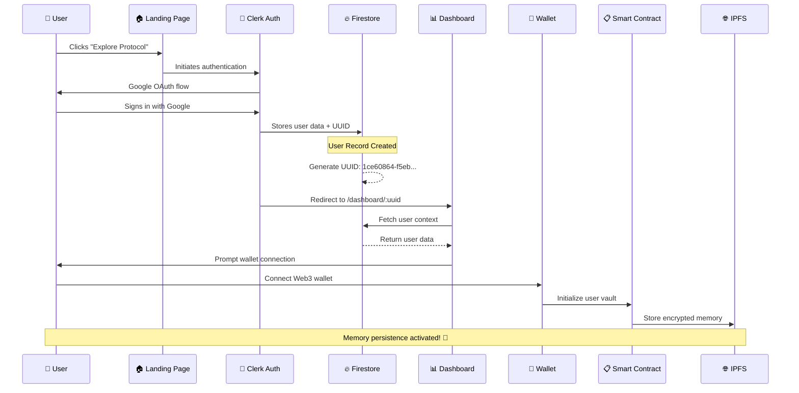

  
# 🧠 De-MAPP
## Decentralized Multi-Agent Persistent Protocol

*🌐 Your AI memory, truly decentralized and eternally persistent*

---

## 💡 The Vision

> **"What if your AI conversations never had to start from zero again?"**

In today's fragmented AI landscape, every interaction begins with a blank slate. ChatGPT doesn't remember your previous sessions, Claude can't recall your preferences from last week, and GitHub Copilot has no context about your project history across different workspaces.

**De-MAPP changes everything.**

We're building the world's first **decentralized memory protocol** that enables AI agents to share persistent, user-owned memory across any platform, application, or service.

---

## 🎯 Core Problems We Solve

### 🔄 **Memory Fragmentation**
Every AI tool operates in isolation, forcing users to repeatedly provide context and preferences.

### 🔒 **Data Ownership Crisis**  
Your conversations and memories are trapped in corporate silos, controlled by tech giants.

### 🚫 **Zero Interoperability**
No standardized way for AI agents to share context across different platforms and services.

### ⚡ **Context Loss**
Valuable insights and learning from AI interactions disappear into the void.

---

## �️ System Architecture

---

## ✨ Revolutionary Features

### 🧠 **Persistent AI Memory**
Your conversations, preferences, and context persist across all AI interactions, forever.

### 🔗 **Cross-Agent Recall**
One unified memory accessible by ChatGPT, Claude, Copilot, and any AI service you choose.

### � **True Decentralization**
Built on Avalanche blockchain with IPFS storage - no single point of failure.

### 👑 **Complete Data Ownership**
You control your data with Web3 wallet authentication and cryptographic keys.

### 🚀 **Seamless Integration**
Plugin ecosystem for VS Code, Chrome, and major AI platforms.

### 🔍 **Full Transparency**
Every memory interaction is auditable on the blockchain.

---

## �️ Technology Stack

| Layer | Technology | Purpose |
|-------|------------|---------|
| **Frontend** | React + TypeScript + Vite | Modern, type-safe UI development |
| **Styling** | Tailwind CSS | Utility-first responsive design |
| **Authentication** | Clerk + Google OAuth | Secure, scalable user management |
| **Database** | Firebase Firestore | Real-time NoSQL data storage |
| **Blockchain** | Avalanche (Fuji Testnet) | Smart contract deployment |
| **Storage** | IPFS + Arweave | Decentralized, permanent data storage |
| **Security** | Lit Protocol | Decentralized key management |
| **Identity** | Web3 Wallets | User-controlled authentication |

---

## 🔐 User Journey Flow

---

## 📊 Dashboard Architecture

### 🎛️ **Navigation System**
- **Header**: Global controls, user profile, wallet status
- **Sidebar**: Quick access to all memory sections

### 🏗️ **Memory Sections**

#### 🌍 **Public Memory Vault**
- Shared knowledge and collaborative insights
- Community-driven AI training data
- Open-source memory contributions

#### 🔒 **Private Memory Vault**  
- Personal AI interaction history
- Private preferences and configurations
- Encrypted with your wallet keys

#### 🏢 **Enterprise Memory Vault**
- Organization-specific knowledge base
- Team collaboration memory
- Role-based access controls

### 📈 **Advanced Features** *(Coming Soon)*
- Interactive memory graph visualizations
- Comprehensive audit trails and analytics  
- Extensible plugin integration system

---

## ⚡ Competitive Advantage Matrix

| **Capability** | **🧠 De-MAPP** | **🤖 ChatGPT** | **🧠 Claude** | **👨‍💻 Copilot** | **💎 Gemini** |
|:---|:---:|:---:|:---:|:---:|:---:|
| **Persistent Memory** | ✅ Permanent | ❌ Session-only | ❌ Session-only | ❌ Session-only | ❌ Session-only |
| **Decentralized Storage** | ✅ IPFS/Arweave | ❌ Centralized | ❌ Centralized | ❌ Centralized | ❌ Centralized |
| **User Data Ownership** | ✅ Web3 Wallet | ❌ Corporate | ❌ Corporate | ❌ Corporate | ❌ Corporate |
| **Cross-Platform Recall** | ✅ Universal | ❌ Isolated | ❌ Isolated | ❌ Isolated | ❌ Isolated |
| **Plugin Ecosystem** | ✅ Extensible | 🟡 Limited | 🟡 Limited | 🟡 Limited | 🟡 Limited |
| **Blockchain Auditability** | ✅ Transparent | ❌ Opaque | ❌ Opaque | ❌ Opaque | ❌ Opaque |
| **Interoperability** | ✅ Protocol-based | ❌ Proprietary | ❌ Proprietary | ❌ Proprietary | ❌ Proprietary |

---

## 🌍 Vision

De-MAPP is more than a dashboard. It’s an AI-native protocol that:
- Enables multi-agent collaboration
- Ensures memory ownership by users
- Creates a persistent intelligence layer for the AI economy

> Think of it as the *“file system for AI memory”* — open, decentralized, and portable.

---

## 📌 Roadmap

- ✅ Landing page + Clerk Auth
- ✅ Firestore UUID integration
- 🚧 Dashboard integration
- 🚧 Wallet + Avalanche contract linking
- 🔜 IPFS/Arweave storage
- 🔜 Lit Protocol key management
- 🔜 Plugins (VS Code, Chrome)

---

## 🤝 Contributing

We welcome contributions!  
Open issues, suggest features, or submit PRs to help build the future of decentralized AI memory.

---

## 📄 License

MIT

---

## 📬 Contact

For questions, reach out via [GitHub Issues](https://github.com/Priyank911/DEmapp/issues)

---

<b>De-MAPP = Your AI memory, decentralized.</b>
